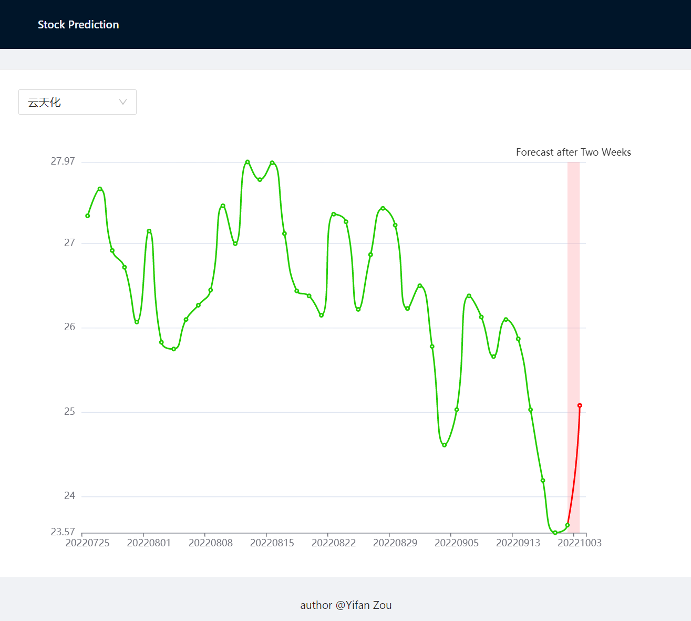

# StockPredictor
Predict the stock price with AI models.

This is the main repository of the [Stock Prediction](https://github.com/users/jingedawang/projects/2) project, which starts as an [internal project](https://hackbox.microsoft.com/project/597) in Microsoft Hackthon 2022.

For investors, please try our online web service: http://stockprediction.org/ <br>
For investigators, please follow the Quick Start to learn more.

## Background

Everyone loves stock. Everyone hates stock.

It's so hard to figure out which direction the price will go in next few weeks. If you are a technical analyst, you may be interested in leveraging AI to dig the potential pattern of a given stock.

MSRA has open-sourced a powerful tool for quantitative investment, which is called [Qlib](https://github.com/microsoft/qlib). We could try to use this framework to construct a useful service for our daily trading.

A simple scenario may like,

**Me**: Please tell me how much the stock xxx will rise at the end of the next 2 weeks?
<br>**Service**: It will decrease 8% from now till that time.
<br>**Me**: Oh shit, I will sell them!

## Quick Start

### Installation & Deployment
It's highly encouraged to use a virtual environment with Anaconda. Please visit [Anaconda](https://www.anaconda.com/) website to download a suitable version for your system and install it.
Then run following commands to create a clean Python 3.8 environment with name `py38`.
```bash
conda create -n py38 python=3.8
conda activate py38
```

Now, let's prepare the dependencies and data.
```bash
pip install numpy
pip install --upgrade cython
pip install yahooquery
pip install bs4

# <your_workspace_dir> is the folder where we put the Qlib and StockPredictor repositories.
cd <your_workspace_dir>
git clone https://github.com/microsoft/qlib.git && cd qlib
pip install .
python scripts/data_collector/yahoo/collector.py download_data --source_dir ~/.qlib/stock_data/source/cn_data --start 1999-01-01 --end 2022-12-31 --delay 1 --interval 1d --region CN
python scripts/data_collector/yahoo/collector.py normalize_data --source_dir ~/.qlib/stock_data/source/cn_data --normalize_dir ~/.qlib/stock_data/source/cn_1d_nor --region CN --interval 1d
python scripts/dump_bin.py dump_all --csv_path ~/.qlib/stock_data/source/cn_1d_nor --qlib_dir ~/.qlib/qlib_data/cn_data --freq day --exclude_fields date,symbol
```

After that, clone this repository and install the dependencies.
```bash
cd <your_workspace_dir>
git clone https://github.com/jingedawang/StockPredictor.git && cd StockPredictor
pip install -r stock_predictor/requirements.txt
playwright install
playwright install-deps
```

Train a prediction model.
```bash
python stock_predictor/train_two_week_predictor.py
```

Do some setup work for the prediction service. This includes loading the stock list into database and doing a complete prediction for all the stocks.
```bash
python stock_predictor/setup.py
```

Before starting the service, we need to setup a schedule to automatically update the data everyday after the market closing time.
Please open the `update_data.crontab` file and change the path of the `collector.py` script according to your local directory.
This manual operation should be eliminated later.
```bash
# Use tmux to monitor the execution of the script.
sudo apt install tmux
tmux new-session -d -s update-data
tmux send-keys -t update-data 'conda activate py38' Enter
crontab config/update_data.crontab
```

Finally we could start our prediction service.
```bash
python stock_predictor/app.py
```


### Web API

Once the prediction service started, you could send requests to the following methods.
Note that stockprediction.org is our public server address, we have deployed an app here already.
You could test the web API on your own machine if you replaced the domain to your address.

#### API 1: Get stock list
```
Url: /stock/list
Description: Get the stock list in China market.
Parameter: None
Response: A JSON string.
Example for request http://stockprediction.org:5000/stock/list:
[
	{
		"id": "000001",
		"pinyin": "PAYH",
		"name": "平安银行",
		"enname": "Ping An Bank Co., Ltd."
	},
	{
		"id": "000002",
		"pinyin": "WKA",
		"name": "万科A",
		"enname": "China Vanke Co.,Ltd."
	},
	{
		"id": "000004",
		"pinyin": "GNKJ",
		"name": "国农科技",
		"enname": "Shenzhen Cau Technology Co.,Ltd."
	}
]
```
#### API 2: Predict
```
Url: /stock/<id>
Description: Predict the after-two-weeks price for the specified stock.
Parameter: <id>: The id of the stock.
Response: A JSON string containing both history prices and predicted price.
Example for request http://stockprediction.org:5000/stock/600000:
{
	"id": "600000",
	"pinyin": "PFYH",
	"name": "浦发银行",
	"qlib_id": "SH600000",
	"enname": "Shanghai Pudong Development Bank Co.,Ltd.",
	"history": [
		{
			"2022-09-06": 7.26
		},
		{
			"2022-09-07": 7.22
		},
		{
			"2022-09-08": 7.24
		},
		{
			"2022-09-09": 7.31
		}
	],
	"predict": {
		"2022-09-23": 7.36
	}
}
```
#### API 3: Predict in specific date
```
Url: /stock/<id>/<date>
Description: Predict the after-two-weeks price for the specified stock at the given date. Only support dates start from 2022-01-01.
Parameter:
    <id>: The id of the stock.
    <date>: The date when performs the prediction.
Response: A JSON string containing both history prices and predicted price for the prediction.
Example for request http://stockprediction.org:5000/stock/600000/2022-04-29:
{
	"id": "600000",
	"pinyin": "PFYH",
	"name": "浦发银行",
	"qlib_id": "SH600000",
	"enname": "Shanghai Pudong Development Bank Co.,Ltd.",
	"history": [
		{
			"2022-04-26": 7.87
		},
		{
			"2022-04-27": 7.83
		},
		{
			"2022-04-28": 7.99
		},
		{
			"2022-04-29": 8.03
		}
	],
	"predict": {
		"2022-05-13": 8.34
	}
}
```

### Web App
We also provide a web app to make this service convenient for users.

Run following commands to start it.
```bash
curl -sL https://deb.nodesource.com/setup_14.x | sudo bash -
sudo apt-get install -y nodejs
cd frontend
npm install
npm run build
serve -s build
```
Then go to http://localhost:3000/ and choose the stock you like.
The webpage should look like


You can also try our public website here http://stockprediction.org/.

## Contribute

### What can I contribute?

It's always welcomed to join us as a developer.
Please check [Issues](https://github.com/jingedawang/StockPredictor/issues) tab and see if there are anything you could contribute.

If you have any ideas, please feel free to leave them in an issue.

### Resources

If you are interested in stock prediction model, there are several resources. The first two should be read carefully.
The third one is the video records of AI school course which teaching the theories of stock models and how to use them.

+ Machine learning framework for stock: [microsoft/qlib](https://github.com/microsoft/qlib)
+ Documentation of Qlib: [Qlib Documentation](https://qlib.readthedocs.io/en/latest/index.html)
+ Course in AI School: [AI + Stock](https://microsoftapc-my.sharepoint.com/:f:/g/personal/jingewang_microsoft_com/EoHHzyc1dRJMvt-b1QgOBS8BENFA4ZXvMUpgnWukliyh1Q?e=4CwYaS)
